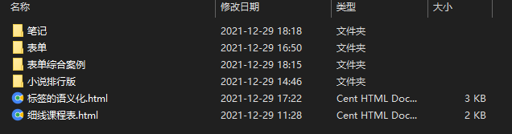

### Talk at First

Hello everybody,I'm glad to know that you're watching my github!This folder is using to record all programs that I have written in web learning!Among them,there are some notes according to the cource,but it's not record by me ,it's the teacher and I think is very detailed and useful!So you can review with it which will play a great role in your web learning.In fact ,I make a plan to learn all this web course in two months for get a great job between Feb. to Apr.. I will review yesterday's content through reading the docx and ppt,of course,I won't forget to do every practice to enhance my understanding.

### What in it

​	For example,the folder named NOTES is a summary about today's course! The leftover other folders are all programs that the teacher tells us to do.

### In the end

​	According to first paragraph,I will learning two day's course one day but I still record learning in Original form!Wish me to persist and get a great job(the salary high over 30k per month when graduate)!I will keep to update everyday's task!

### Language learning timeline

- `2021.12.28~2021.12.29————HTML Base`
- `To be continued……`

